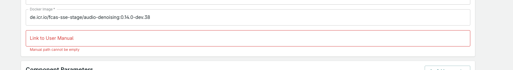
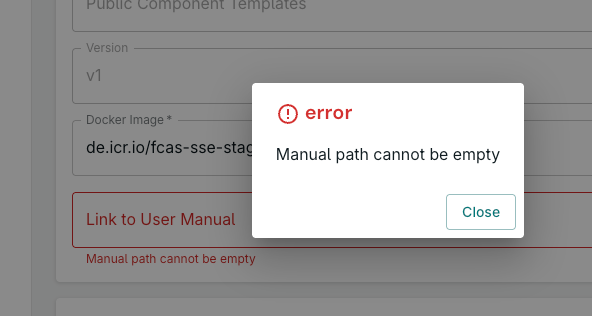

# 🐞 Bug Report: "Manual path cannot be empty" error on optional field

**Summary:**  
When editing a component template, submitting the form without a value for the "Manual path" field results in a backend error:

```
{ status: 400, message: "Manual path cannot be empty" }
```

This occurs even though the "Manual path" field is marked as optional in both the UI and the backend schema.

---

## Steps to Reproduce

1. Go to the "Edit Template" page for any component.
2. Leave the "Manual path" field empty.
3. Submit/save the form.
4. Observe the error message in the UI and/or network response.

---

## Expected Behavior

- If the "Manual path" field is left empty, the backend should accept the request and not return a 400 error.
- The field should truly be optional, and the template should save successfully without a manual path.

---

## Actual Behavior

- The backend returns a 400 error with the message "Manual path cannot be empty".
- The UI displays an error dialog and highlights the field in red.

---

## Screenshots




---

## Environment

- Frontend: [local version of this repo]
- Backend: [devbranch we are working on]
- Browser: [brave, most recent]
- OS: macOS

---

## Additional Notes

- The field is marked as optional in the UI.
- This may be caused by a validation check in the backend that does not allow empty values, even when the field is optional.

---

## Acceptance Criteria

- [x] Submitting the form with an empty "Manual path" does not result in an error.
- [rejected] The backend accepts empty or missing values for this field.
- [x] The UI does not display an error when the field is left empty.

---

## Developer Response & Recommended Fix (2025-05-26)

**Root Cause:**

- The frontend always sends the `manualPath` field, even when it is empty, resulting in the backend treating an empty string as invalid and returning a 400 error. The backend expects the field to be omitted or set to `null` if not provided, as it is optional.

**Recommended Solution:**

- Update the frontend so that if the "Manual path" field is left empty, the `manualPath` property is omitted from the payload (or set to `null`) when submitting the form.
- This approach is:
  - Easier to implement and peer review (only a small change in the frontend form logic)
  - Clearer to understand for future maintainers
  - Does not require backend changes or contract updates
- After this change, leaving the field empty will no longer trigger a backend validation error, and the field will truly be optional as intended.

---