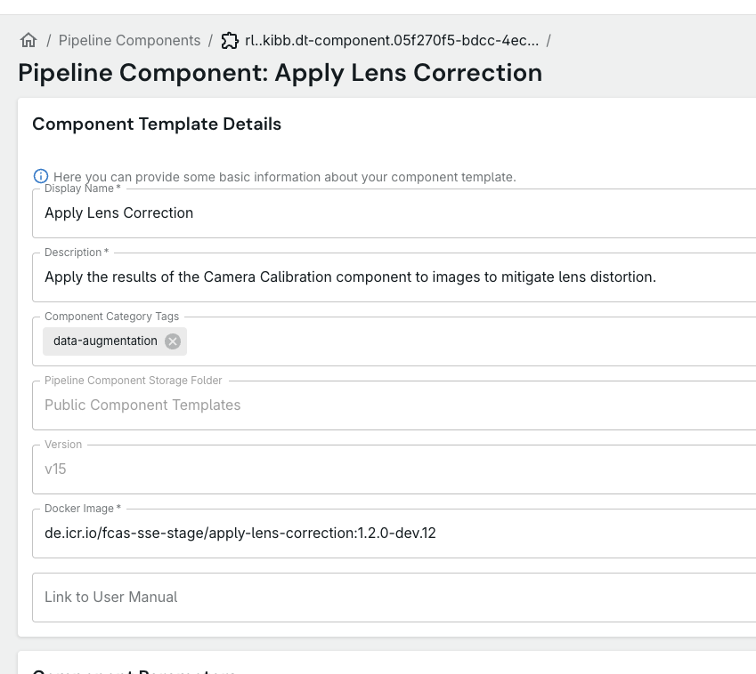

# 🐞 Bug Report: Manual Link Field Lacks Proper Header and Placeholder

**Summary:**
The new "Link to User Manual" field in the component template form does not display its label as a header above the input, unlike other fields (e.g., "Display Name*", "Description*"). Instead, the label appears inside the input as a suggestion. This is inconsistent with the rest of the form and reduces clarity for users.

---

## Steps to Reproduce

1. Go to the component template creation or edit page.
2. Observe the "Link to User Manual" field at the bottom of the form.
3. Notice that the label is inside the input box, not above it as a header.

---

## Expected Behavior

- The field should have a header label above the input, reading: **"Link to User Manual"** (consistent with other fields).
- The input box should have a placeholder (suggestion text inside the field) such as: https://his.fcas...-/user-manual/...

---

## Actual Behavior

- The label "Link to User Manual" appears inside the input as a suggestion (placeholder), not as a header above the field.
- There is no example placeholder URL inside the input.

---

## Screenshots

---

## Environment
- Frontend: [local version of this repo]
- Browser: [e.g., Chrome, Brave]
- OS: macOS

---

## Additional Notes
- The text inside the input is called a **placeholder**.
- All other fields use a header label above the input for clarity and consistency.

---

## Acceptance Criteria
- [x] The "Link to User Manual" field displays its label as a header above the input.
- [x] The input field has a placeholder with an example URL.
- [~] The form is visually consistent with other fields.
