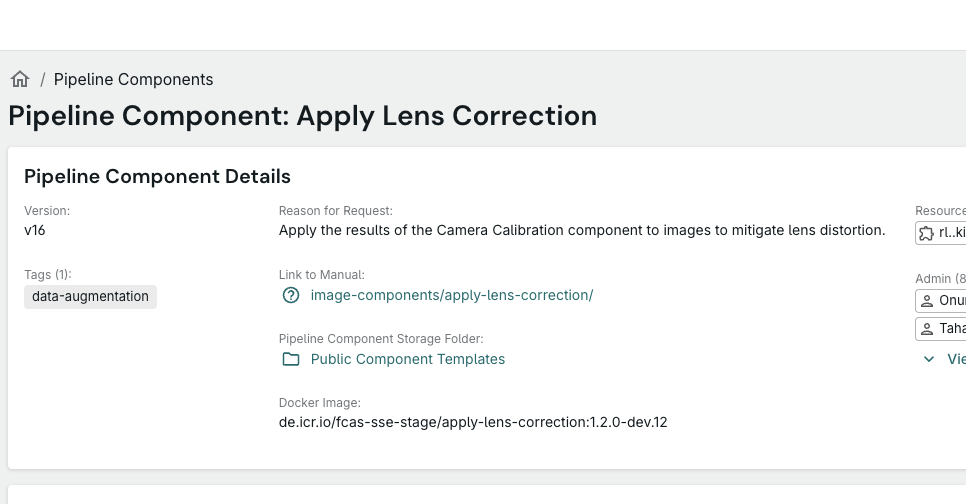

# 🐞 Bug Report: Replace Question Mark Icon with Material UI "Menu Book" Icon

**Summary:**
The icon for the manual/documentation link currently uses a circle with a question mark. This should be replaced with a specific documentation/bookmark icon—the Material UI [Menu Book icon](https://mui.com/material-ui/material-icons/?query=menu+book) (see SVG below)—for better clarity and consistency. The new icon must use the same color as the current question mark icon.

---

## Steps to Reproduce

1. Navigate to the **Component Template Details Page** (view mode only):
   `http://localhost:3000/data-transformation/pipeline-component/[resource-locator]`
   Example: `http://localhost:3000/data-transformation/pipeline-component/rl..kibb.dt-component.05f270f5-bdcc-4ec8-b45f-b03f072ee3b4.v17`

2. Look at the detail card section at the top of the page, below the "Reason for Request:" header

3. Find the "Link to Manual:" row which displays the manual path as a clickable petrol-colored link

4. Observe the **question mark icon (❓)** in front of the manual link text

**Note:**
- This issue is **ONLY** on the details/view page, **NOT** the edit page
- The "Pipeline Component Storage Folder" row below it correctly shows a folder icon
- Only one single icon needs to be changed from ❓ to 📖

---

## Expected Behavior

- The question mark icon (❓) should be replaced with the Material UI [Menu Book icon](https://mui.com/material-ui/material-icons/?query=menu+book) (📖)
- The new icon must use the same color as the current question mark icon for visual consistency
- The icon should visually represent documentation or a manual, not a generic help/question mark
- The new icon must match the official Material UI "Menu Book" SVG path exactly
- **This is expected to be a single line change in one file**

  ```svg
  <path d="M21 5c-1.11-.35-2.33-.5-3.5-.5-1.95 0-4.05.4-5.5 1.5-1.45-1.1-3.55-1.5-5.5-1.5S2.45 4.9 1 6v14.65c0 .25.25.5.5.5.1 0 .15-.05.25-.05C3.1 20.45 5.05 20 6.5 20c1.95 0 4.05.4 5.5 1.5 1.35-.85 3.8-1.5 5.5-1.5 1.65 0 3.35.3 4.75 1.05.1.05.15.05.25.05.25 0 .5-.25.5-.5V6c-.6-.45-1.25-.75-2-1m0 13.5c-1.1-.35-2.3-.5-3.5-.5-1.7 0-4.15.65-5.5 1.5V8c1.35-.85 3.8-1.5 5.5-1.5 1.2 0 2.4.15 3.5.5z"></path>
  ```

---

## Actual Behavior

- The icon is currently a circle with a question mark (❓), which is less clear for documentation/manual links
- This appears only on the Component Template Details Page (view mode) in the "Link to Manual:" row

---

## Screenshots

- **Current:**
  

- **Desired:**
  

---

## Acceptance Criteria

- [ ] The question mark icon (❓) is replaced with the Material UI "Menu Book" icon (📖) in the Component Template Details Page
- [ ] The new icon uses the provided SVG path exactly
- [ ] The new icon uses the same color as the current question mark icon
- [ ] The change affects only the "Link to Manual:" row, not any other icons
- [ ] The change is implemented as a single line modification
- [ ] The change is visually confirmed in the UI and screenshots are updated if needed

---

## Additional Notes

- This change improves clarity and aligns the icon with its intended purpose (documentation/manual link)
- The SVG path above is the exact icon that must be used for this change
- Reference: [Material UI Menu Book icon](https://mui.com/material-ui/material-icons/?query=menu+book)
- **Technical Note**: The question mark icon appears because the manual path DetailCardLinkEntry is missing the `rl` prop, causing it to default to HelpOutlineRounded icon
- **Estimated Implementation**: Add a new case for "manual" entity type in the getEntityIcon function and provide the `rl="manual"` prop to the DetailCardLinkEntry
