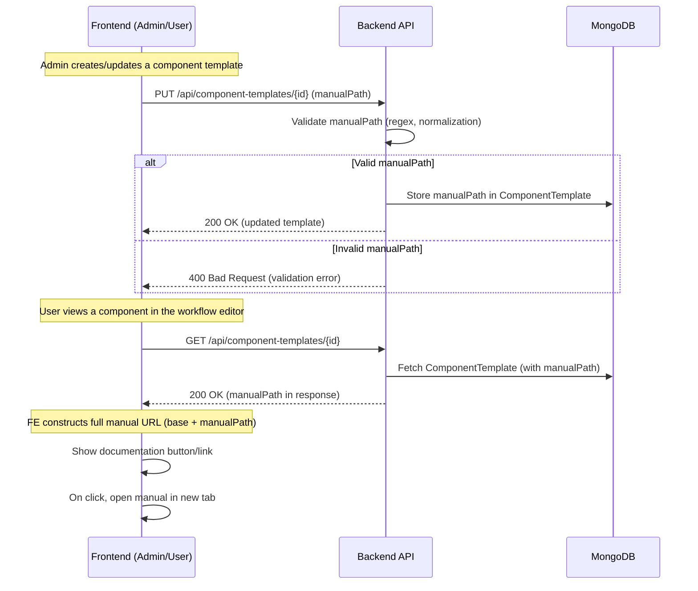

# 06 - Technical Overview

### Purpose

- Provides API endpoints for component templates which include the field `manualPath` for storing and serving a path to the specific component templates in the user manual.

---

#### Main Endpoints

| Method | Endpoint                        | Description                                      | Auth Required |
|--------|---------------------------------|--------------------------------------------------|--------------|
| GET    | /api/component-templates        | List all component templates (with manualPath)    | ✅           |
| GET    | /api/component-templates/{id}   | Get a specific component template (with manualPath)| ✅           |
| PUT    | /api/component-templates/{id}   | Update a component template (set manualPath)      | ✅           |
| ...    | ...                             | ...                                              | ...          |

---

### Workflows

This diagram illustrates the basic request flow from client to service and back.



---

### Integration Points

- **Database:** MongoDB (stores component templates and their manualPath fields)

---

### Implementation Details

#### Backend Path Validation

The backend performs the following validation and normalization on the `manualPath` field:

```kotlin
private fun validateAndExtractPath(input: String?): String? {
    if (input == null) return null
    if (input.isBlank()) {
        throw IllegalArgumentException("Manual path cannot be empty")
    }
    
    // Extract path if full URL is provided
    val baseUrl = "https://his.fcas-offen-2bf7313ba140d2ec7addb97cacba3e38-i000.eu-de.containers.appdomain.cloud/user-manual/documentation/data-transformation/"
    val path = if (input.startsWith(baseUrl)) {
        input.substring(baseUrl.length)
    } else {
        input
    }
    // Only the path is persisted in MongoDB, never the full URL

    // Validate for URL-safe characters
    val urlSafePattern = "^[a-zA-Z0-9-_./#]+$".toRegex()
    if (!urlSafePattern.matches(path.trim())) {
        throw IllegalArgumentException("Manual path can only contain letters, numbers, hyphens, periods, underscores, slashes and hash symbols")
    }
    
    // Length check
    if (path.length > 200) {
        throw IllegalArgumentException("Manual path is too long (max 200 characters)")
    }
    
    // Normalize the path (remove leading slash if present)
    val normalizedPath = if (path.startsWith("/")) path.substring(1) else path
    
    return normalizedPath
}
```

#### Error Handling

Special exception handling is implemented for the `manualPath` field validation errors:

```kotlin
@ExceptionHandler
fun handleManualPathValidationException(exception: IllegalArgumentException): ResponseEntity<ErrorMessageModel> {
    // Only apply special handling for manualPath validation errors
    if (exception.message?.startsWith("Manual path") == true) {
        logger.warn("Manual path validation error: ${exception.message}")
        return handleException(exception.message, HttpStatus.BAD_REQUEST.value())
    }
    // For other IllegalArgumentExceptions, use internal server error
    logger.error(exception.message, exception)
    return handleException(exception.message, HttpStatus.INTERNAL_SERVER_ERROR.value())
}
```

#### Frontend Validation and Display

The frontend:

1. Shows a tooltip with guidance for the input format
2. Validates input using a similar pattern to the backend
3. Shows specific error messages for validation failures
4. Provides feedback when the backend processes or normalizes the submitted path
5. Displays the exact saved path value in the UI (not a reconstructed path)
6. Constructs the full URL only at click time using the stored path

This implementation ensures consistency and transparency in how manual paths are handled throughout the system.

---

### Manual Documentation Link Feature (FR01-Links_to_Manual)

- The UI always displays the manual documentation link button in the component modal. The button opens the manual in a new tab and uses the correct MUI component for external links with proper security props.
- The frontend accepts both full URLs (with the hardcoded base) and just the path part. Only the path is stored in the database.
- Validation and normalization logic for `manualPath` is consistent between frontend and backend, using the unified regex `^[a-zA-Z0-9-_./#]+$`.
- Error handling is robust: clear error messages are shown for invalid input, and the UI displays the exact value stored in the database.
- Manual and end-to-end tests (including the scenario for supplying only a path) are documented in the DoD and peer review checklist.
- The detailed, chronologically structured Erfahrungsbericht documents the full process, technical decisions, and validation outcomes. See [10-erfahrungsbericht.md](./10-erfahrungsbericht.md).

---

#### Manual Test Scenario: Supplying Only a Path

- As a user, enter only a path (e.g., `/audio-components/add-colored-noise/`) in the manual documentation field.
- Save the component and verify the backend accepts and stores the path, and the UI displays the documentation link correctly.
- No error or warning is shown if the path is valid; invalid paths show a clear error message.
- Document the observed behavior and update the Erfahrungsbericht if any issues or deviations are found.
